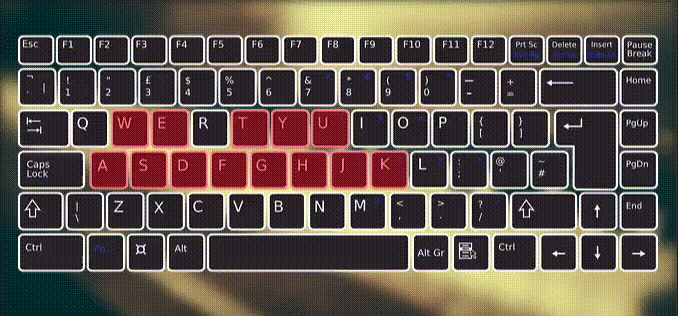
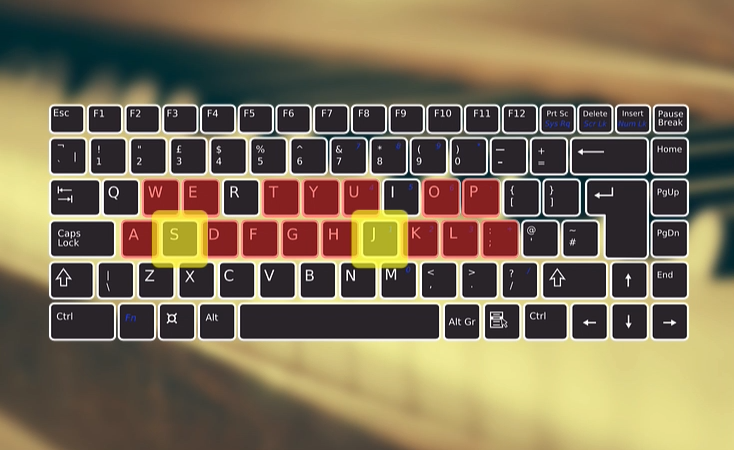

#  Piano
* Old version  

* New version : added Db5 D5 Eb5 E5  

## Play test

* Play on [https://juliendkim.000webhostapp.com/](https://juliendkim.000webhostapp.com/)

## Note

* Download Piano sound files from [https://github.com/gleitz/midi-js-soundfonts](https://github.com/gleitz/midi-js-soundfonts)
* Download Images from [https://pixabay.com/](https://pixabay.com/)
